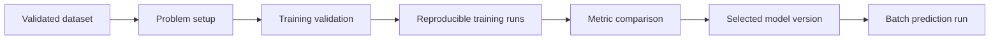

# DatApp Predictive Modeling Design

## Purpose

DatApp predictive modeling will let a user train, compare, select, and apply
models without turning the product into an unrestricted code-execution
platform. It will build on datasets that have already passed DatApp validation
and deterministic quality analysis.

The first release will support tabular regression and classification with
scikit-learn. Forecasting, clustering, and anomaly detection will follow only
after the supervised-learning workflow is stable.

## Product flow



1. Select a validated dataset inside a project.
2. Choose a problem type: regression or classification.
3. Select one target column and eligible feature columns.
4. Review DatApp's validation warnings and split strategy.
5. Train baseline and candidate models as background jobs.
6. Compare metrics, limitations, and feature importance.
7. Promote one successful run to a project model version.
8. Apply that version to a schema-compatible dataset.

## Domain placement

```text
Workspace
└── Project
    └── Dataset version
        └── ML experiment
            ├── Training run
            │   └── Model artifact
            └── Prediction run
```

- **ML experiment:** Stable user intent, including problem type, target,
  features, split strategy, and primary metric.
- **Training run:** One immutable execution with dataset identity, parameters,
  environment versions, seed, status, metrics, and failure details.
- **Model artifact:** A server-generated file belonging to one successful run.
- **Prediction run:** A traceable application of one model version to one
  compatible dataset version.

All records inherit authorization through their workspace and project. Model
files are never public and are not accepted as user uploads.

## Initial model families

The system will begin with a deliberately small, explainable set:

| Problem | Required baseline | Initial candidates | Primary metric options |
| --- | --- | --- | --- |
| Regression | Mean or median predictor | Linear model, tree ensemble | MAE, RMSE, R² |
| Classification | Most-frequent or stratified predictor | Logistic model, tree ensemble | F1, ROC AUC, log loss |

DatApp must display the baseline next to candidates. A complex model is not
considered useful merely because it completed training.

## Training pipeline

Preprocessing and prediction must use the same fitted pipeline:

- Numeric features: type validation, bounded missing-value imputation, and
  scaling only when the estimator benefits from it.
- Categorical features: missing-category handling and unknown-safe encoding.
- Date/time features: explicit derived features; raw identifiers are excluded
  by default.
- Free text, files, and unsupported nested values: rejected in the initial
  release.

The pipeline is fitted only on training folds. No statistics, encoders, feature
selection, or imputation values may be learned from validation or test rows.

## Validation and safety rules

Training is blocked when the configuration is invalid or misleading:

- Too few usable rows or target values.
- A constant target or a classification class with insufficient examples.
- Target included in the feature set.
- Identifier-like or near-unique columns selected without explicit review.
- Unsupported types, infinite values, or excessive missingness.
- A time-dependent problem configured with a random split.
- A prediction dataset whose required schema is incompatible.

Resource limits will bound row count, feature count, candidate count, training
time, memory, and artifact size. Training runs outside FastAPI request handlers
and can be cancelled. User-provided Python, pickle, or executable model files
will not be accepted.

## Reproducibility and lineage

Every run stores:

- Dataset and dataset-version identifiers plus a content fingerprint.
- Selected features, target, filters, and preprocessing configuration.
- Split method, test size, cross-validation configuration, and random seed.
- Estimator family and sanitized hyperparameters.
- Python and relevant package versions.
- Metrics, warnings, timestamps, actor, and resulting artifact checksum.

Training records and metrics live in PostgreSQL. Dataset snapshots and model
artifacts use private managed storage. A database record points to the artifact;
the artifact is never stored directly in a database column.

## Evaluation and explainability

Metrics depend on the problem and dataset shape. DatApp will explain why a
metric was chosen and will show validation variation rather than a single score
without context.

Initial explainability will include global feature importance or model
coefficients when meaningful, data-quality warnings, class distribution, and a
plain-language limitations panel. Feature importance indicates association,
not causation.

## Lifecycle states

Training runs use `queued`, `running`, `succeeded`, `failed`, and `cancelled`.
Successful model versions use `candidate`, `promoted`, and `archived`.
Promotion is an explicit user action and does not overwrite previous versions.

Later lifecycle work may add drift checks, scheduled batch prediction,
retraining policies, and performance monitoring when true labels arrive.

## Deliberate exclusions

The initial predictive-modeling release will not include:

- Deep learning or GPU training.
- Arbitrary user code, notebooks, or custom Python packages.
- Unbounded AutoML or hyperparameter searches.
- Real-time prediction endpoints exposed to the public internet.
- AI-generated claims that replace deterministic metrics and validation.
